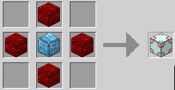
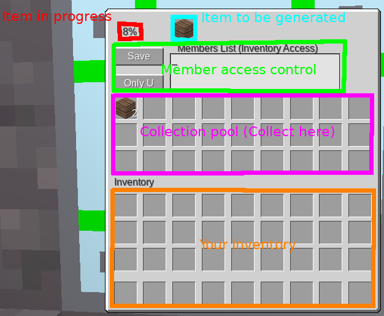

# Item Replicator > Help System > MCL

Recipe:

General Overview:

### Item to be generated

Place item to be generated (only 1 is needed in this slot) in Item to be generated slot.

### Item in progress

Observe the progress of the item replication at Item in progress.

### Member access control (MAC)

Add a playername 1 per line (That's it, just 1 per line, no comma or anything else) then hit Save.

To quickly lock, unlock or open to public click the Only U button (This button will change who has access, Only U, Members, Public)

> You need to save when you change access level or add/remove a player's name.

What do they mean? (Access Level)

* `Only U`, only you the player who has access to add/remove members, change the item to be generated and change the access level can access the replicator. (Screen shows only if you have access)
* `Members`, only you the player who "owns" the replicator, and those in the Members List can access the replicator. (Members can't change the item being generated or add/remove members or change access level, only take and add to the Collection Pool)
* `Public`, anyone can access the replicator. (only the player who "owns" the replicator can change the item being generated, add/remove members and change access level)

In practice:

I want to make a public apple replicator on my server for everyone to use.

> I'd use the Public access level so anyone can take from or put into the Collection Pool area.

I have a friend who what's to use my wood replicator?

> I'd use the Members access level where I add my friend's playername to the Members List (don't forget to save).

### Collection Pool

This is where the Item to be generated gets replicated to, from here most/all players (based on MAC settings) can pull or put items.

This could be used as a small chest... but really it's for stuff being made.

### Your Inventory

Yup, that be your inventory, the inventory of the current player accessing the replicator. (Nothing special there)
